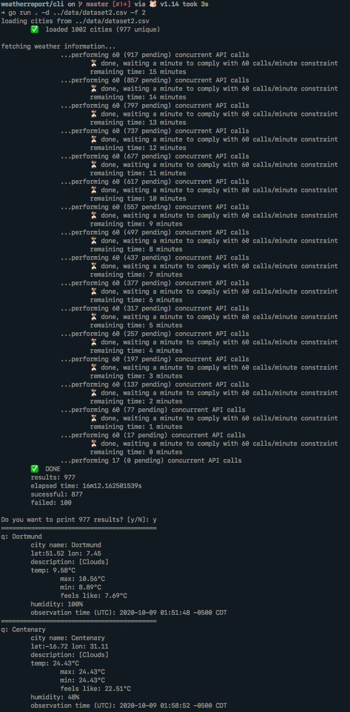

# Weather Report

Weather report is a CLI used to obtain weather information from a given dataset of flight tickets.

***Disclaimer***: *This is a school project and some interfaces and APIs are influenced by the
project requierements, don't use this as a whole with any production purposes (until
college-related features are completely dropped).*



## Folder structure

All source contained here is laid out as a valid [**Go module**](https://blog.golang.org/using-go-modules)
such that it can be easily installed and built with commands like `go get github.com/pablotrinidad/weatherreport`
and documentation gets automatically generated and published by tools like [pkg.go.dev](https://pkg.go.dev/).

Folders:
* `cli`: Is the application entrypoint that handles the dataset parsing and communication with the storage layer.
* `store`: Is the storage layer of the application, it abstracts away the communication with the third-party
services and cache system.
* `store/openweather`: Is the HTTP API Client for OpenWeather.
* `docs`: Project description written in LaTeX. `.tex` and `.pdf` output file can be found there. 

## Running the application

#### Environment variables
Set the following environment variables:

```build
OPENWEATHER_API_KEY
```

_You can use the command `export VAR_NAME=VAR_VALUE`_

#### Building and running

1. Place the source under `$GOPATH/src/github.com/pablotrinidad/weathereport`.
2. cd into `cli`, i.e: `cd cli/`
3. Run the app with `go run . -d DATASET_FILE -f DATASET_FORMAT`, where `DATASET_FILE` is the path
of your valid .csv file (relative or absolute), and `DATASET_FORMAT` is either `1` for airports
dataset or `2` for cities dataset.

### Dataset assumptions

The application makes some assumptions about the data present in each dataset format. Generally
it assumes its perfectly tabular, column types are consistent across rows and values are correct,
that is, no further validations will be applied against cell values. e.g: If you use `Niu Jork Ziti`
as a city name for dataset format `2`, then no sanitization nor further corrections will be applied
to that value (except for trimming whitespaces). Another example: If for dataset with format `1`
(airport codes dataset) you incorrectly enter the coordinates for a given airport code, those 
will be used to perform the weather query. 

Formats are:

#### 1: Airports dataset

Each row in the dataset contains 2 airport codes (origin and destination) and their corresponding
coordinates laid out in the following order and types

| origin airport code | destination airport code | origin lat | origin lon | destination lat | destination lon |
|---------------------|--------------------------|------------|------------|-----------------|-----------------|
| `string`            | `string`                 | `float`    | `float`    | `float`         | `float`         | 

 
 #### 2: City names
 
 Each row consists of only a valid (recognized by OpenWeather) city name
 
| city name |
|-----------|
| `string`  |  
 
 #### Important notes:
 
 * Additional columns will be ignored.
 * Type/emptiness validations run before performing any queries, malformed datasets will stop the
 program execution before performing any query.
 * Table headers are ignored by default.
 
 ## Open Weather
 
 This program assumes you have an API key subscribed to the [***Free Plan***](https://openweathermap.org/price).
 If you want to perform more than 60 API calls per minute (and you have an API Key subscribed to a valid plan),
 you can change the limit on the number of concurrent calls per minute by modifying  the
 `maxConcurrentRequestsPerMinute` value inside `store/concurrentstore.go`.

 
 ## Contributors
 
 - Pablo Trinidad ([@pablotrinidad](https://github.com/pablotrinidad))
 - Diego Jardón ([@jardondiego](https://github.com/jardondiego))
 
 ## Next steps
 
 - [ ] Remove CLI (was part of a school project and adds no value).
 - [ ] Support more OpenWeather API endpoints.
 - [ ] Decouple store methods from school project requirements, i.e: notion of airports.
 - [ ] Make mock clock for testing batches of concurrent requests.
 - [ ] Add CONTRIBUTING.md
 - [ ] Add automatic linting PR comments (golint)
 - [ ] Output results to a different source/format (not STDOUT)
 - [ ] Remove `data/` folder with school project test data.
 - [ ] Remove all school-related info at `docs/`